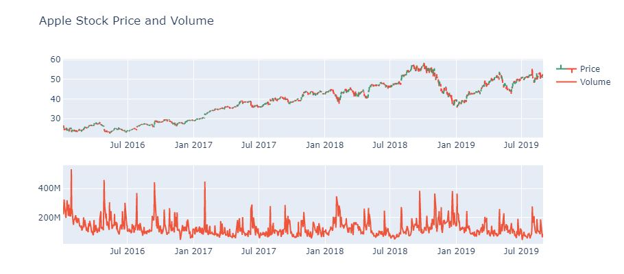
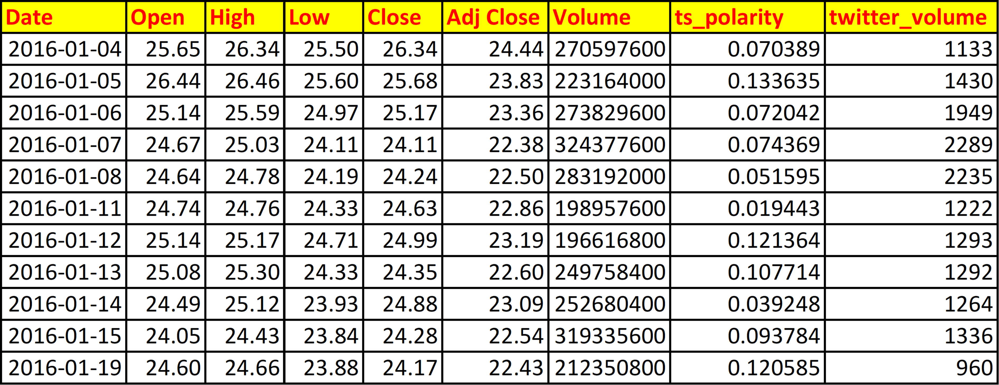
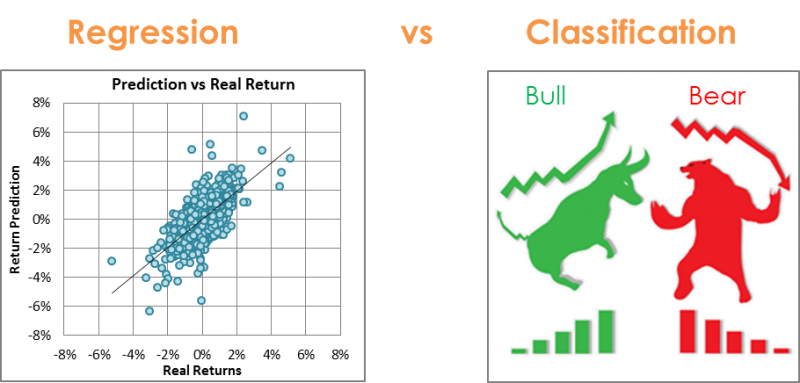
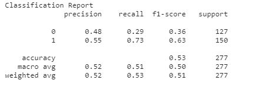
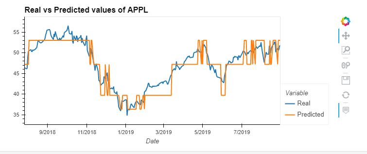
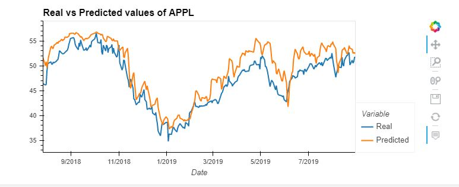
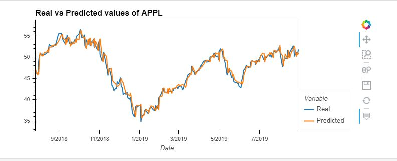

# Project 2 - Group # 4

## Sentiment Analysis of Twitter Data for predicting movement in stock price of Apple Inc. (AAPL)

*Source: https://devpost.com/software/tweetpredict*

### Project Description:

This project is about analyzing social media data about Apple Inc. and predicting its future stock trend with sentiment classification.
We applied sentiment analysis and machine learning principles to discover the possible effect of "public sentiment" on "market trends".

Prediction of stock price is an extremely  complex and  very  challenging task  because there are  too  many  factors  involved  such  as  economic circumstances,  political  events,  and  other  environmental factors which may impact the stock price. Due to these factors, it is difficult to find out the dependence of a single factor on future prices and trends.

The popularity  and importance  of numerous social  media platforms has risen  to new levels over the past few years,  as more people  spend time online. One such social media platform that has seen an explosive rise in popularity is Twitter. Twitter is a rich source of real-time  information  regarding  current  societal  trends  and opinions. The "Twittesphere" is a melting pot driving various opinions, emotions and trends and could be a pivotal factor in influencing and shaping perceptions.

Some [statistics](
    https://blog.hootsuite.com/twitter-statistics/) regarding Twitter:

* Twitter has 145 million monetizable daily active users.

* 30 million (or 20%) of Twitter’s daily users are American.

* 92% of the U.S. population is familiar with Twitter (even if they don’t use it).

* According to a recent survey by [Pew Research Center](https://www.pewresearch.org/fact-tank/2019/08/02/10-facts-about-americans-and-twitter/), around one-in-five U.S. adults (22%) say they use Twitter.

* Twitter stands out as one of the social media sites with the most news-focused users.

Behavioural economics tell us that people are  not rational consumers and individual behaviours and decisions are greatly affected by emotions and indeed  by the opinions of others. Twitter  sentiment  analysis  can  be  extremely  helpful  for predicting  emotions  or  opinion  on a certain  stock.  So examining  the trending mood on Twitter  and observing its relationship to the movement in stock price can help predict the future trend in the market.

### Data Preprocessing

1. Twitter data from [Kaggle](https://www.kaggle.com/nadun94/twitter-sentiments-aapl-stock)  for Apple stock was used for sentiment analysis. The time frame chosen to analyze data is `January 01, 2016` to `August 31, 2019`.   
    
2. We collected daily Apple stock data for the same time period from [Yahoo Finance](https://finance.yahoo.com/quote/AAPL/history?p=AAPL) for historical data analysis and stock price/trend prediction.

3. Twitter information was processed to use only data for the dates the stock market was open (approximately 252 trading days per year).

4. Twitter Data and Daily stock prices were merged together and a final csv was generated which was used as base data. For all the predictive analyses, we have used the adjusted close price of AAPL.

 **Please note that the prices have been recaliberated to take into account the stock split which happened on 31st August 2020.**

### Model training and evaluation

Different machine learning techniques were used to train and evaluate models to analyze and determine the correlation between twitter sentiment and Apple stock price. 

Two approaches for analyses were used:

1. **Classification:** In this approach the twitter polarity scores were used to classify tweets into positive, negative and neutral sentiment. The adjusted closing prices of Apple stock were converted to a binary form (0 and 1), where 0 means that the value of the company stock price is less than the day before, and 1 means that the value is greater than the day before. This provided a trend for stock price movement. 

    Algorithms used for analysis:

    **Random Forest Classifier**

    Random Forest Classifier is an ensemble method, meaning that a random forest model is made up of a large number of small decision trees, called estimators, which each produce their own predictions. The random forest model combines the predictions of the estimators to produce a more accurate prediction.

    **Gradient Boosting Classifier**

    Gradient Booster algorithm builds trees one at a time, where each new tree helps to correct errors made by previously trained tree. With each tree added, the model becomes even more expressive. There are typically three parameters - number of trees, depth of trees and learning rate, and each tree built is generally shallow.

2. **Regression:** In this approach the twitter polarity scores, twitter volume and the adjusted closing prices were used to predict the future movement in Apple stock price. The adjusted closing prices data was stuctured such that previous time steps were used as input variables and the next time step as the output variable.

    Algorithms used for analysis:

    **Random Forest Regressor**

    Random Forest Regression is a supervised learning algorithm that uses ensemble learning method for regression. Ensemble learning method is a technique that combines predictions from multiple machine learning algorithms to make a more accurate prediction than a single model.

    **LSTM RNN**

    Long short-term memory (LSTM) is an artificial recurrent neural network (RNN) architecture used in the field of deep learning. LSTM networks are well-suited for making predictions based on time series data, since there can be lags of unknown duration between important events in a time series.

    **XGBoost Regressor**

    XGBoost is short for Extreme Gradient Boosting and is an efficient implementation of the gradient boosting machine learning algorithm.

### Results/ Key findings

*Source : https://www.kaggle.com/anniepyim/essential-classification-algorithms-explained*

#### Approach 1: Classification
Random Forest Classifier

Gradient Boosting Classifier

With Accuracy scores in the range of 50-55%, the classification approach did not yield much confidence so as to justify usage to correlate stock movement with Twitter Sentiments.

#### Approach 2: Regression

Random Forest Regressor: RMSE: `0.0993` | R-squared: `82.27%`

LSTM RNN: RMSE: `0.1334` | R-squared: `68.01%`

XGBoost Regressor: RMSE: `0.0477` | R-squared: `95.92%`

Using the regression approach yielded favorable results as against classification. These models relied heavily on the previous prices and as is visible from the trends, Twitter sentiments were not accurately indicative of stock price movements. The XG Boost regressor was observed to be the optimum model to simulate future prices.

### Limitations/ What could have been done differently?

1. Twitter API has limitations on the amount of data that can be accessed. Therefore, a document with Twitter information regarding Apple stock from Kaggle was used.

2. The Kaggle dataset also had limited data (Jan'16 - Aug'19) which restricted our analysis to limited number of trading days.

3. NewsAPI headlines besides Twitter could also have been used for sentiment analysis.

4. Identifying optimum hyperparameters to fine tune the model outputs.

### References:

1. https://arxiv.org/pdf/1610.09225.pdf

2. https://www.researchgate.net/publication/315562673_Twitter_Data_Predicting_Stock_Price_Using_Data_Mining_Techniques

3. https://blog.hootsuite.com/twitter-statistics/

4. https://www.kaggle.com/mtszkw/using-xgboost-for-stock-trend-prices-prediction

5. https://machinelearningmastery.com/xgboost-for-time-series-forecasting/

6. https://www.datacamp.com/community/tutorials/xgboost-in-python

7. https://towardsdatascience.com/an-introduction-to-random-forest-using-tesla-stock-prices-d9c6e113be3c

"# stock-price-movements" 
